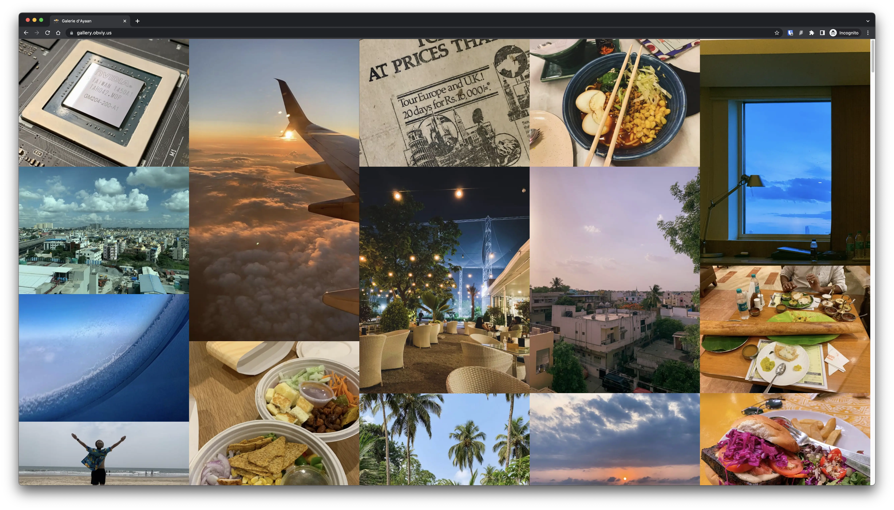

<p align="center">
    
</p>

<h2 align="center">Musée</h2>

<p align="center">
  
  
  
</p>

<p align="center">Fast, responsive, self-hosted image gallery. Ships minimal JS to the client.</p>

[Musée](https://www.collinsdictionary.com/dictionary/french-english/mus%C3%A9e) (pronounced myu-zay) was written primarily to experiment around with https://remix.run/ but now re-written using https://astro.build. Until now I had been using the _ excellent_ [`waschinski/photo-stream`](https://github.com/waschinski/photo-stream) gallery for hosting my images but felt limited with having to use Ruby. The eventual goal of Musée is to ship **ZERO** client side JS to the client while maintaining the masonry layout.

Unfortunately, a responsive masonry layout is [not possible](https://stackoverflow.com/a/45200955/11940280) without the use of client-side JS to determine the window size (used for calculating the number of columns). At least until [CSS Grid Masonry](https://drafts.csswg.org/css-grid-3/#masonry-layout) becomes available.

<a align="center" href="https://gallery.obviy.us/">
    
</a>

<p align="center">
  <a href="https://gallery.obviy.us/"><code>[ Live Demo ]</code></a>
</p>

## ✨ Features

- [x] Generate image thumbnails
- [x] Compress original images
- [x] Strip image metadata before deployment
- [x] Typescript support
- [x] Statically Generated
- [x] Uses TailwindCSS
- [x] OpenGraph meta tags
- [ ] Captions for images
- [ ] Device metadata for images
- [ ] Image geo-tag map generation

## 📸 Live Examples

- [gallery.obviy.us](https://gallery.obviy.us/)
- [tarun.photos](https://tarun.photos/)

Feel free to make a PR to add your own.

## 🏗 Development

1. Install dependencies.

```bash
$ npm install
```

Load your images in the `src/assets/images/original` directory.

2. Start development server

```bash
$ npm run dev
```

## 🚀 Deployment

Deployment (for now) is done to Cloudflare Pages. Documentation is available here: https://developers.cloudflare.com/pages/framework-guides/astro/

## Contributing

I'm relatively inexperienced with React so any and all contributions are welcome.

This repository uses the automated [`semantic-release`](https://github.com/semantic-release/semantic-release) suite of tools to generate version numbers. All commit messages **must** conform to the [Angular Commit Message conventions](https://github.com/angular/angular/blob/master/CONTRIBUTING.md#-commit-message-format).
