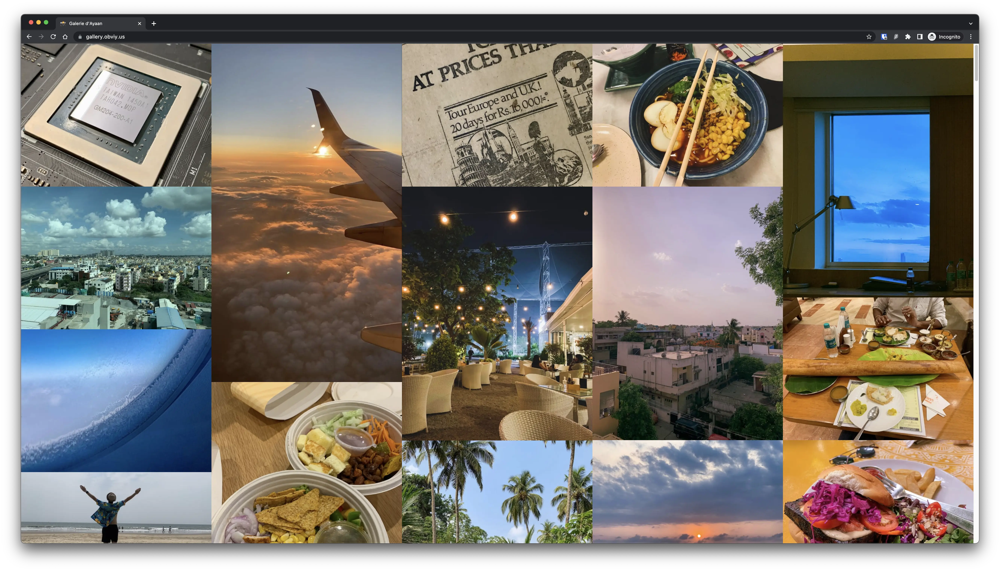

<p align="center">
    
</p>

<h2 align="center">Musée</h2>

<p align="center">
  
  
  
</p>

<p align="center">Fast, responsive, self-hosted image gallery. Ships <strong>ZERO</strong> JavaScript to the client.</p>

[Musée](https://www.collinsdictionary.com/dictionary/french-english/mus%C3%A9e) (pronounced myu-zay) was written primarily to experiment around with https://remix.run/ but now re-written using https://astro.build. Until now I had been using the _excellent_ [`waschinski/photo-stream`](https://github.com/waschinski/photo-stream) gallery for hosting my images but felt limited with having to use Ruby. 

**Mission accomplished!** Musée now ships **ZERO** client-side JavaScript while maintaining a responsive masonry layout with proper horizontal ordering. This is achieved through Astro's build-time static generation, pre-calculating column distributions for each breakpoint and using pure CSS for responsive display.

<a align="center" href="https://gallery.obviy.us/">
    
</a>

<p align="center">
  <a href="https://gallery.obviy.us/"><code>[ Live Demo ]</code></a>
</p>

## ✨ Features

- [x] **Zero JavaScript** sent to clients
- [x] True masonry layout with horizontal ordering
- [x] Generate image thumbnails
- [x] Compress original images
- [x] Strip image metadata before deployment
- [x] Typescript support
- [x] Statically Generated
- [x] Uses TailwindCSS
- [x] OpenGraph meta tags
- [x] CSS-only animations
- [x] Works with JavaScript disabled
- [ ] Captions for images
- [ ] Device metadata for images
- [ ] Image geo-tag map generation

## 📸 Live Examples

- [gallery.obviy.us](https://gallery.obviy.us/)
- [tarun.photos](https://tarun.photos/)

Feel free to make a PR to add your own.

## 🏗 Development

1. Install dependencies.

```bash
$ bun install
```

Load your images in the `src/assets/images/original` directory.

2. Start development server

```bash
$ bun run dev
```

### Private image store

`src/assets/images/original/` is gitignored. Keep personal images there, build locally, and push only code changes.

Recovered images named `slug__filename.webp` keep `slug` as the public route. Other images get generated stable slugs.

## 🚀 Deployment

Deployment (for now) is done to Cloudflare Pages. Documentation is available here: https://developers.cloudflare.com/pages/framework-guides/astro/

```bash
$ bun run deploy:personal
```

## 🏛️ Architecture

Musée achieves zero JavaScript by:
- Pre-calculating masonry column distributions at build time for each breakpoint
- Using CSS media queries to show/hide the appropriate pre-rendered layout
- Replacing React components with Astro components
- Moving all date calculations to build time
- Using pure CSS animations instead of JavaScript libraries

## Contributing

Any and all contributions are welcome.

This repository uses the automated [`semantic-release`](https://github.com/semantic-release/semantic-release) suite of tools to generate version numbers. All commit messages **must** conform to the [Angular Commit Message conventions](https://github.com/angular/angular/blob/master/CONTRIBUTING.md#-commit-message-format).
