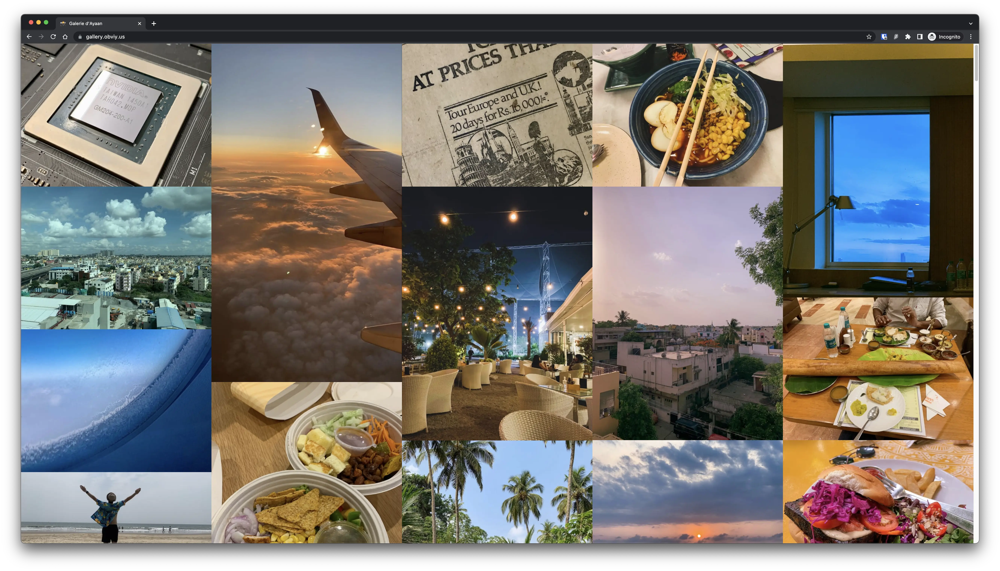

<p align="center">
    
</p>

<h2 align="center">Musée</h2>

<p align="center">
  
  
  
</p>

<p align="center">Fast, responsive, self-hosted image gallery. Ships <strong>ZERO</strong> JavaScript to the client.</p>

[Musée](https://www.collinsdictionary.com/dictionary/french-english/mus%C3%A9e) (pronounced *myu-zay*) is a self-hosted photo gallery that ships **ZERO** client-side JavaScript — and still keeps a true masonry layout with correct horizontal ordering, fully responsive, working even with JS disabled.

The trick: Astro pre-computes the column distribution for every breakpoint at build time, and CSS media queries swap between the pre-rendered layouts. Even the animations are pure CSS. (It started life as a Remix experiment, then got rewritten on Astro — replacing the _excellent_ but Ruby-bound [`waschinski/photo-stream`](https://github.com/waschinski/photo-stream) I used to run.)

<a align="center" href="https://gallery.obviy.us/">
    
</a>

<p align="center">
  <a href="https://gallery.obviy.us/"><code>[ Live Demo ]</code></a>
</p>

## ✨ Features

- [x] **Zero JavaScript** sent to clients
- [x] True masonry layout with horizontal ordering
- [x] Generate image thumbnails
- [x] Compress original images
- [x] Responsive photo pages with a full-size download link
- [x] Strip image metadata before deployment
- [x] Typescript support
- [x] Statically Generated
- [x] Uses TailwindCSS
- [x] OpenGraph meta tags
- [x] CSS-only animations
- [x] Works with JavaScript disabled
- [x] Sitemap and image structured data
- [ ] Captions for images
- [ ] Device metadata for images
- [ ] Image geo-tag map generation

## 📸 Live Examples

- [gallery.obviy.us](https://gallery.obviy.us/)
- [tarun.photos](https://tarun.photos/)

Feel free to make a PR to add your own.

## 🏗 Development

1. Install dependencies.

```bash
$ bun install
```

Astro 7 runs on Bun. TypeScript stays on 6.x because `astro check` requires its programmatic compiler API; TypeScript 7 does not yet provide that API.

Import photos from their current location:

```bash
bun run photos:add ~/Pictures/photo.jpg
```

2. Start development server

```bash
$ bun run dev
```

### Private image store

`src/assets/images/original/` and `src/assets/images/catalog.json` are gitignored. Photos, their IDs, dates, order, and redirects stay out of the project repository.

The import command assigns each photo a permanent ID once and copies it into the private store. The catalog is authoritative; IDs are never regenerated from file paths or image contents. Filenames carry the ID before `__`, so changing folders, the rest of the filename, or the image encoding does not change its photo-page URL. Keep that prefix when renaming files.

New photos are placed first, sorted by capture date from newest to oldest within each import. Photos without capture dates follow the dated photos in that batch. Existing catalog order stays unchanged. Reorder the private catalog's `photos` array to change gallery order. Photo pages show fixed capture dates only when available. Add former IDs to a photo's `aliases` array to preserve old links with permanent redirects; an ID cannot belong to two photos.

HEIC and HEIF imports use Bun's native decoder on macOS or Windows and store a lossless PNG copy. The source file stays intact. Capture dates respect embedded time-zone offsets.

### Recovering after losing the local image store

Each deployment includes `/photos.json`, containing the published photo URLs and the catalog data needed to preserve IDs, order, dates, and aliases. It is part of the gallery deployment, not the Git repository.

In a fresh checkout, install dependencies and run:

```bash
bun run photos:restore https://your-gallery.example
```

Restore refuses to overwrite an existing private store. It downloads into a staging directory and installs the catalog only after all photos are available. It recovers the published, compressed images; keep a separate backup if you need camera originals or their private metadata.

## 🚀 Deployment

Deployment (for now) is done to Cloudflare Pages. Documentation is available here: https://developers.cloudflare.com/pages/framework-guides/astro/

```bash
$ bun run deploy:personal
```

The command checks that generated images contain no private metadata or unprocessed original files, then publishes `dist/` to the production `master` branch of Cloudflare Pages project `musee`. Build from the private image store locally; commit and push code only.

## 🏛️ Architecture

Musée achieves zero JavaScript by:
- Pre-calculating masonry column distributions at build time for each breakpoint
- Using CSS media queries to show/hide the appropriate pre-rendered layout
- Replacing React components with Astro components
- Moving all date calculations to build time
- Using pure CSS animations instead of JavaScript libraries

## Contributing

Any and all contributions are welcome.

This repository uses the automated [`semantic-release`](https://github.com/semantic-release/semantic-release) suite of tools to generate version numbers. All commit messages **must** conform to the [Angular Commit Message conventions](https://github.com/angular/angular/blob/master/CONTRIBUTING.md#-commit-message-format).
